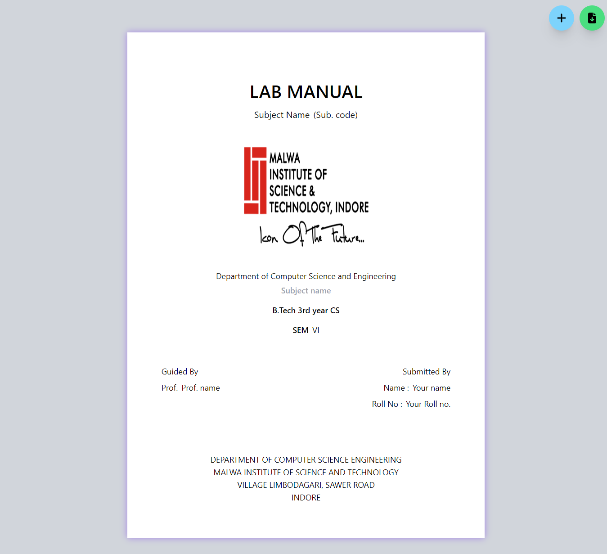

# Lab Manual Front Page Generator

This project allows users to create a custom lab manual front page of My college MIST (Malwa Institute of Science and Technology, indore) by entering their name and other information. The front page is generated using HTML, Tailwind CSS, and JavaScript, and can be downloaded as a PDF.

## Live Demo

[Lab Manual Front Page Generator](https://himanshu-paliwal-277.github.io/College-Lab-Manual-Page-website/)

## Features

- Customizable fields for user input (e.g., name, subject, subject code)
- Real-time preview of the front page
- Downloadable front page as a PDF
- Multiple front page Downloadable as a PDF

## Technologies Stack

 - ***HTML:*** Structure of the web page.
 - ***Tailwind:CSS:*** Styling of the web page.
 - ***JavaScript:*** Functionality and dynamic interactions in the web page.

## Project Screenshot

